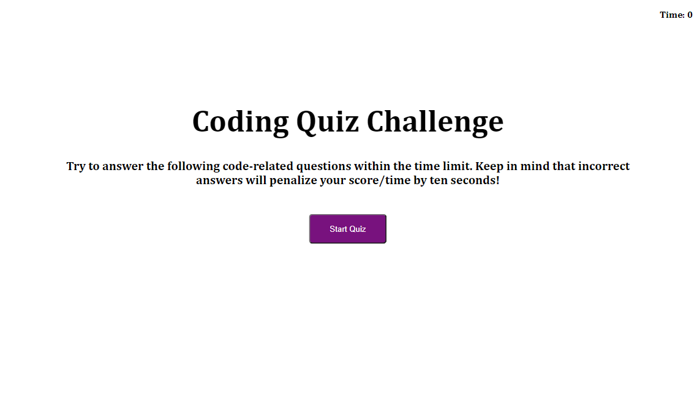

# Polished-Quiz

Polished-Quiz's purpose is to ask user a series of questions while:
* Having a timer
* Keeping score
* Incorrect questions decrease the timer
* Keeping a high score

## Languagues used

HTML, CSS, JavaScript

## Live URL

https://salgorog.github.io/polished-quiz/

